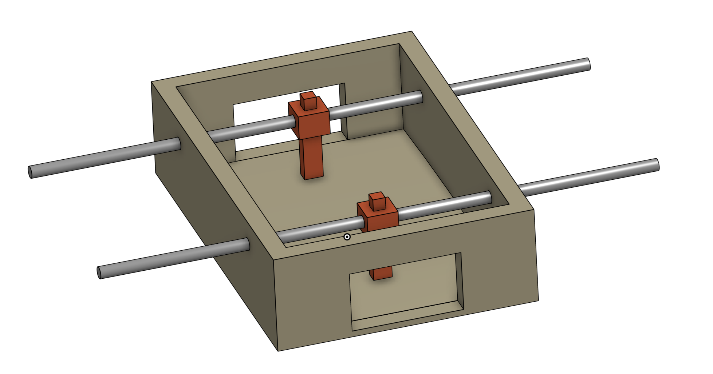

# Foosball RL

This repo contains the code required to train two foosball goalies to play
foosball against each other. The repo is structured as follows

1. `foosball_envs`
   > This is what it sounds like.
2. `onshape_robot`
   > This is also what it sounds like. I pulled the foosball CAD from my onshape
   > and converted into urdf via
   > [onshape-to-robot](https://onshape-to-robot.readthedocs.io/en/latest/)
3. `policy_extraction`
   > These scripts are to get the PyTorch model out of the sb3 or RLlib wrappers
4. `test_scripts`
   > These scripts were for me to sanity check things. You will probably never
   > have to touch them again
5. `train_scripts`
   > What they sound like.

## Training

### One Goalie

To train a model you can run `python3 -m train_scripts.train_single_goalie`

Don't forget the `-m`. This script will train a single goalie to block shots
continuously fired at it. It should train to ~100% (with max speeds up to 15m/s)
pretty quickly (like 10 minutes on my mac). You can then watch it by running
`python3 watch_single_goalie.py --run_dir <wherever you saved>`.

### Two Goalies

To train two goalies to learn to play simultaneously, you can either run
`python3 -m train_scripts.sb3_selfplay` or
`python3 -m train_scripts.RLlib_selfplay`. These train the same thing, but with
sb3 and RLlib respectively. sb3 is faster and less of a headache IMO even though
it wasn't built for the multi-agent stuff.

Currently these scripts just fire balls randomly at either home or away, and
then home or away learns to block the shots. This was more of a sanity check
than anything to ensure that the policy could still block ~100% of shots while
seeing the opponent's movements. The `FoosballVersusEnv` mirrors the "away"
person's observations and actions so that one policy can be trained to control
both home and away.

I plan to make these guys learn to face off against each other and learn to play
true foosball next.
